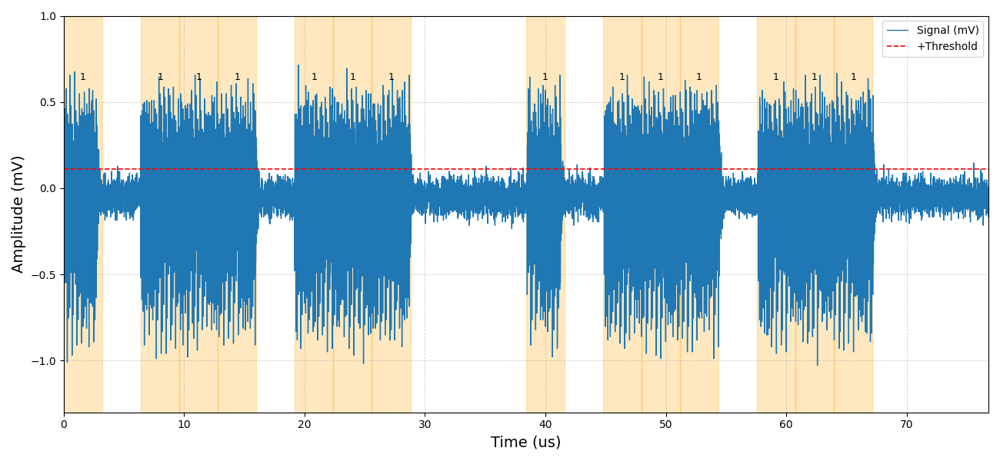
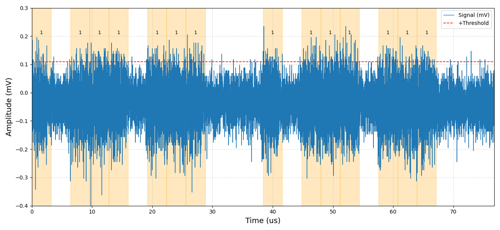
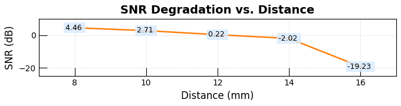

# Distance-Dependent Signal Characterization Using a Near-Field Probe  
*(Fixed Antenna Loop Configuration on the FPGA)*

## Part I: Time-Domain Waveform Visualization  
**Data file:** `2000_8mm_visualization.csv` ,`2000_14mm_visualization.csv` 
**Related figure:** Fig.6 

The CSV file contains time-domain measurement data used for waveform visualization in the manuscript.  
Time (µs) and signal amplitude (mV) are plotted directly without modification.  
The waveform is segmented into fixed-duration time windows aligned with the experimental bit sequence.  
Highlighted windows indicate bit value **1** for illustration only; no decoding or signal processing is performed.

**Original figure:**  

---

## Part II: Distance-Dependent Bit-Window-Based SNR Estimation
**Data file:** `2000_8mm.csv`~`2000_16mm.csv`  
**Related figure/table:** Fig.6  

The signal is segmented into fixed-duration bit windows according to a predefined experimental bit sequence.  
Windows with bit value **1** are treated as signal windows, while windows with bit value **0** are treated as noise windows.  
The signal-to-noise ratio (SNR) is calculated by comparing the average power in signal and noise windows.  
SNR values measured at different near-field probe distances are used to quantify the distance-dependent signal degradation, with the antenna loop count on the FPGA kept constant.

**Original figure:** 
