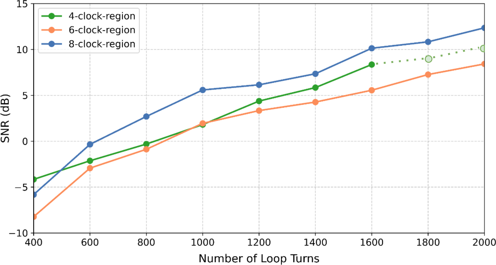

# SNR Analysis Based on Averaged Power from Repeated Measurements

**Data directory:** `data_subset/` (representative subset)  
**Related figure:** Fig. 7  

*The provided `data_subset/` is a representative feature dataset in which each original measurement folder (64 CSV files) is reduced to 3 characteristic CSV files while preserving the complete directory structure and experimental semantics.*

This dataset is used to evaluate the signal-to-noise ratio (SNR) under different antenna layouts and loop cycle counts.

---

## Data Organization

The base directory contains multiple subfolders corresponding to different antenna layouts (e.g., *small*, *big*, and *large*).  
For each layout and each cycle count, two subfolders are provided:

- `*_0`: noise-only measurements (bit value 0)  
- `*_1`: signal-plus-noise measurements (bit value 1)

Each folder contains multiple CSV files acquired under identical experimental conditions.

**Note:** For the *small* layout, the datasets for **cycle = 1800 (`*_1`)** and **cycle = 2000 (`*_0` and `*_1`)** were not acquired due to experimental or routing constraints and are therefore excluded from the analysis.

---

## Power Estimation

For each CSV file, the average signal power is calculated from the voltage samples.  
All CSV files within the same folder are then averaged to obtain a representative power value for that condition.

---

## Visualization

The calculated SNR values are plotted as a function of cycle count.  
Each curve corresponds to a different antenna layout, enabling direct comparison of SNR performance across layouts.

---

## Purpose

This analysis leverages statistical averaging over repeated measurements to quantify signal quality as a function of antenna layout and loop cycle count.  
The resulting SNR trends are used for performance comparison and discussion in the manuscript.

**Original figure:**  

