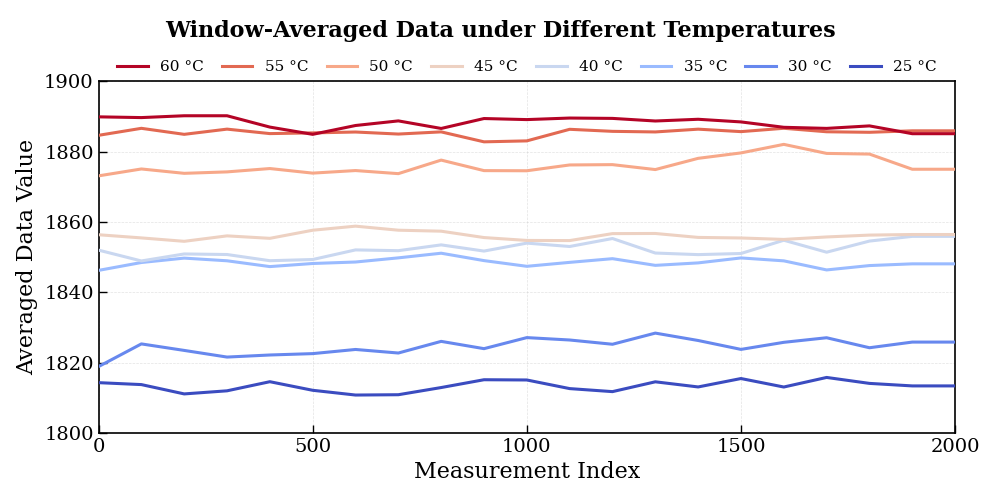
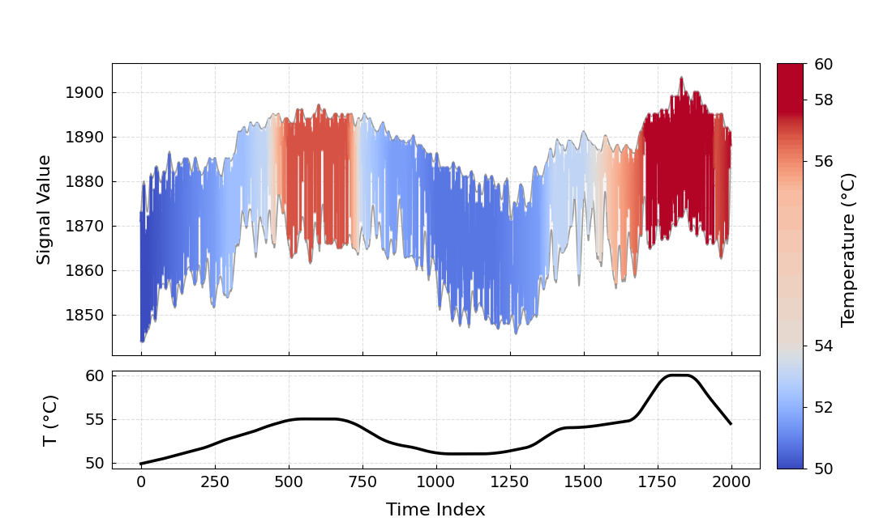

# Temperature-Dependent Signal Visualization

## Part I: Discrete-Temperature Measurements  
**Data files:** `25.txt` ~ `60.txt`  
**Related figure:** Fig.8  

Each data file corresponds to measurements acquired at a fixed experimental temperature.  
The signal is plotted using window-averaged values to reduce fluctuations and highlight the stable signal level.  
Signals obtained at different temperatures are compared in a single figure to analyze temperature-dependent trends and stability.

**Original figure:** 

---

## Part II: Time-Resolved Temperature Sweep  
**Data file:** `time.txt`  
**Related figure:** Fig.9  

This data file contains continuous signal measurements acquired during a temperature sweep.  
The signal trajectory is color-coded according to the reconstructed temperature and shown together with the temperature profile.  
The figure is used to visualize the correlation between signal evolution and temperature variation over time.

**Original figure:**  
